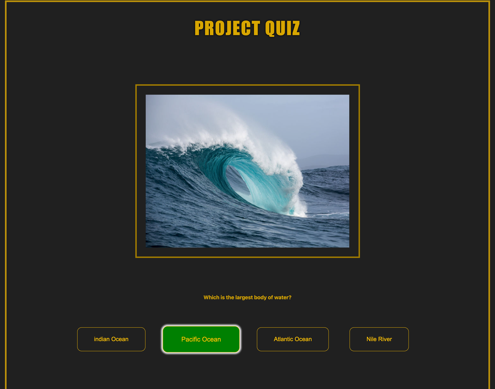

# Project VProject Quiz

A practical project for Supercode Fullstack Web-Dev Bootcamp.
in This project the Developer was allowed to create only one Element (
)in the HTMl file and generate the rest of Content in usein Javascript Functions and methods.

## Demo

You can check the result out in the following video:

https://youtu.be/_nL01Gop4Ok

## Deployment

To deploy this project click the link below

https://samuelaliyari.github.io/Project-Quiz/

## Tech Stack

**Client:** HTML, SCSS, Javascript

**Server:** Github Pages

## Authors

- [@Samuel Aliyari](https://github.com/samuelaliyari)

## Screenshots

## Upcoming Features

🚧 Points Counter 

🚧 Right / Wrong Answer animation

🚧 Right / Wrong Answer soundeffect
